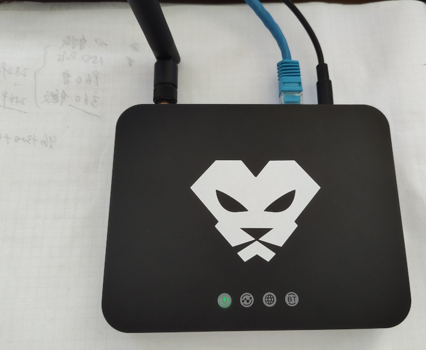
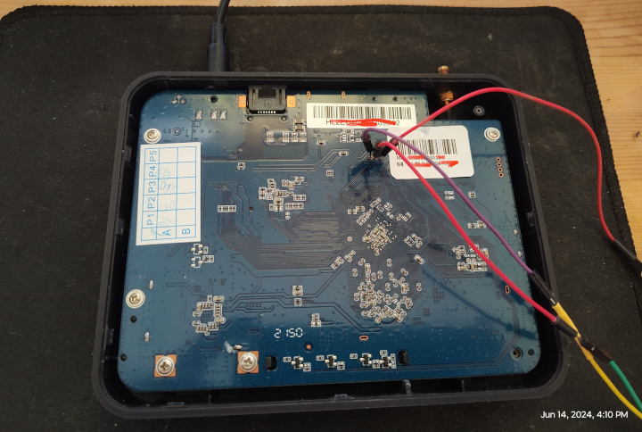
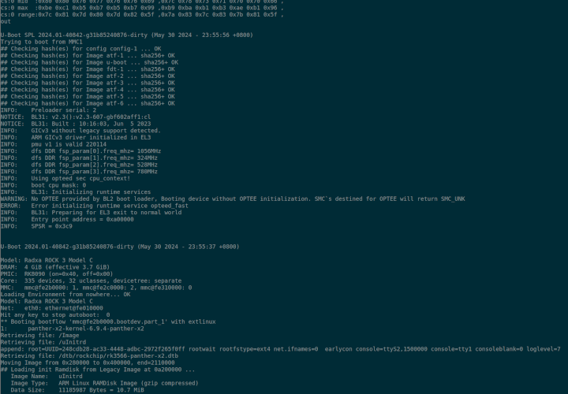
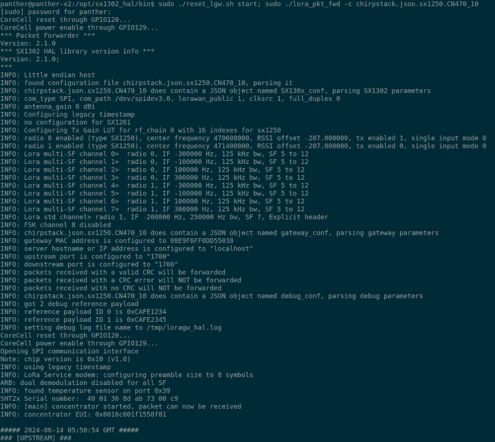

# Panther X2
## Product Introduction
The [Panther X2](https://panther.global) has a 4-core high-performance processor, ultra-low power consumption and ultra-long-distance IoT hotspot gateway. In addition, as an information converter for the LoRa communication protocol, Panther X2 acts as an end node

## Features and Specifications
|Hardware Specification||
|----|----|
|CPU 	|●Quad-core Cortex-A55 up to 1.8GHz|
|Memory 	|●DDR 4GB
|Storage 	|●eMMC 32GB+ TF Card 64GB
|LoRa radio 	|●External SMA antenna
|Wi-Fi radio 	|●2.4GHz 1Tx/1Rx 802.11 b/g/n ●Built-in antenna|
|BLE radio 	|●2.4GHz BLE 5.2<br>●Built-in antenna|
|Crypto chip 	|●Microchip ATECC608|
|LAN interface 	|●RJ45 1Gbps x 1|
|TF 	|●External TF card slot<br>●Supports SDXC or higher speed|
|USB 	|●External USB-A 2.0 connector<br>●Reserved for future use|
|LEDs 	|●Single-colored LED indicator (green) x 4<br>-Power<br>-Status<br>-Network<br>-Bluetooth|
|Button 	|●Push-button (GPIO)|
|Environment 	|●Temp. operating -10°C ~ +40°C ambient<br>●Storage -20°C ~ +70°C ambient<br>●Humidity operating 5%RH ~ 95%RH (non-condensed relative humidity)<br>●Altitude operating 0 ~ 3000 Meters|
|IP ratings 	|●IP42 (plastic enclosure)|
|Power 	|●DC jack<br>●DC12V 1~1.5A|




* Releases:
  * [Kernel 6.9.4](#kernel-6.9.4)
  * [U-Boot 2024.01 ](#u-boot)
  * [Debian 12(bookworm)](https://www.debian.org/News/2023/20230610)

## U-boot

U-Boot 2024.01



* Pre-built

```sh
    https://github.com/yjdwbj/panther-x2/archive/refs/tags/v1.0.tar.gz
```


## Kernel 6.9.4

Kernel 6.9.4 is rock solid in Panther X2, building **Kernel 6.9.4** with gcc-12 on uSD for testing new devfreq and checking stability.

Testing mainline **6.9.4**, current status:

* Eth0 - ok
* Wifi brcmfmac43430-sdio (SDIO) - ok
* BT BCM43430A1 (UART) - ok
* USB2 - ok
* [sx1302 (SX1308 SX1257)](https://github.com/Lora-net/sx1302_hal) - ok
* [ATECC608](https://github.com/contactless/atecc-util) - ok
* [Media Process Platform (MPP) module](https://github.com/rockchip-linux/mpp) - pre-installed

## Benchmarks

* CPU info

```sh
panther@panther-x2:~$ lscpu
Architecture:             aarch64
  CPU op-mode(s):         32-bit, 64-bit
  Byte Order:             Little Endian
CPU(s):                   4
  On-line CPU(s) list:    0-3
Vendor ID:                ARM
  Model name:             Cortex-A55
    Model:                0
    Thread(s) per core:   1
    Core(s) per cluster:  4
    Socket(s):            -
    Cluster(s):           1
    Stepping:             r2p0
    CPU(s) scaling MHz:   70%
    CPU max MHz:          1800.0000
    CPU min MHz:          408.0000
    BogoMIPS:             48.00
    Flags:                fp asimd evtstrm aes pmull sha1 sha2 crc32 atomics fphp asimdhp cpuid asimdrdm lrcpc dcpop asimddp
NUMA:
  NUMA node(s):           1
  NUMA node0 CPU(s):      0-3
Vulnerabilities:
  Gather data sampling:   Not affected
  Itlb multihit:          Not affected
  L1tf:                   Not affected
  Mds:                    Not affected
  Meltdown:               Not affected
  Mmio stale data:        Not affected
  Reg file data sampling: Not affected
  Retbleed:               Not affected
  Spec rstack overflow:   Not affected
  Spec store bypass:      Not affected
  Spectre v1:             Mitigation; __user pointer sanitization
  Spectre v2:             Not affected
  Srbds:                  Not affected
  Tsx async abort:        Not affected
```

* login motd

```sh
 ____             _   _
|  _ \ __ _ _ __ | |_| |__   ___ _ __
| |_) / _` | '_ \| __| '_ \ / _ \ '__|
|  __/ (_| | | | | |_| | | |  __/ |
|_|   \__,_|_| |_|\__|_| |_|\___|_|

Welcome to Debian GNU/Linux 12 (bookworm) with Linux 6.9.4-panther-x2

System load:   3%           	Up time:       47 min
Memory usage:  4% of 3.65G  	IP:	       192.168.1.166 192.168.10.1
CPU temp:      40°C

Last login: Fri Jun 14 16:55:11 2024 from 192.168.1.100
```

* 7zr b

```sh
panther@panther-x2:~$ 7zr b

7-Zip (a) [64] 16.02 : Copyright (c) 1999-2016 Igor Pavlov : 2016-05-21
p7zip Version 16.02 (locale=en_US.UTF-8,Utf16=on,HugeFiles=on,64 bits,4 CPUs LE)

LE
CPU Freq: 64000000 64000000 - 64000000 - - - - -

RAM size:    3734 MB,  # CPU hardware threads:   4
RAM usage:    882 MB,  # Benchmark threads:      4

                       Compressing  |                  Decompressing
Dict     Speed Usage    R/U Rating  |      Speed Usage    R/U Rating
         KiB/s     %   MIPS   MIPS  |      KiB/s     %   MIPS   MIPS

22:       2683   352    743   2611  |      74934   397   1612   6393
23:       2635   367    731   2685  |      72364   394   1589   6261
24:       2535   373    730   2726  |      71337   399   1571   6262
25:       2429   379    731   2774  |      68806   398   1538   6124
----------------------------------  | ------------------------------
Avr:             368    734   2699  |              397   1578   6260
Tot:             382   1156   4480


```

* openssl (crypto)

```sh
panther@panther-x2:~$ openssl speed -elapsed -evp aes-128-gcm aes-128-cbc sha256
You have chosen to measure elapsed time instead of user CPU time.
Doing sha256 for 3s on 16 size blocks: 2606349 sha256's in 3.00s
Doing sha256 for 3s on 64 size blocks: 2458172 sha256's in 3.00s
Doing sha256 for 3s on 256 size blocks: 2036077 sha256's in 3.00s
Doing sha256 for 3s on 1024 size blocks: 1215031 sha256's in 3.00s
Doing sha256 for 3s on 8192 size blocks: 255875 sha256's in 3.00s
Doing sha256 for 3s on 16384 size blocks: 133658 sha256's in 3.00s
Doing aes-128-cbc for 3s on 16 size blocks: 29434916 aes-128-cbc's in 3.00s
Doing aes-128-cbc for 3s on 64 size blocks: 21750738 aes-128-cbc's in 3.00s
Doing aes-128-cbc for 3s on 256 size blocks: 10575163 aes-128-cbc's in 3.00s
Doing aes-128-cbc for 3s on 1024 size blocks: 3484431 aes-128-cbc's in 3.00s
Doing aes-128-cbc for 3s on 8192 size blocks: 479614 aes-128-cbc's in 3.00s
Doing aes-128-cbc for 3s on 16384 size blocks: 241439 aes-128-cbc's in 3.00s
Doing AES-128-GCM for 3s on 16 size blocks: 17125265 AES-128-GCM's in 3.00s
Doing AES-128-GCM for 3s on 64 size blocks: 12559915 AES-128-GCM's in 3.00s
Doing AES-128-GCM for 3s on 256 size blocks: 6027506 AES-128-GCM's in 3.00s
Doing AES-128-GCM for 3s on 1024 size blocks: 2181988 AES-128-GCM's in 3.00s
Doing AES-128-GCM for 3s on 8192 size blocks: 316689 AES-128-GCM's in 3.00s
Doing AES-128-GCM for 3s on 16384 size blocks: 160050 AES-128-GCM's in 3.00s
version: 3.0.11
built on: Mon Oct 23 17:52:22 2023 UTC
options: bn(64,64)
compiler: gcc -fPIC -pthread -Wa,--noexecstack -Wall -fzero-call-used-regs=used-gpr -DOPENSSL_TLS_SECURITY_LEVEL=2 -Wa,--noexecstack -g -O2 -ffile-prefix-map=/build/reproducible-path/openssl-3.0.11=. -fstack-protector-strong -Wformat -Werror=format-security -DOPENSSL_USE_NODELETE -DOPENSSL_PIC -DOPENSSL_BUILDING_OPENSSL -DNDEBUG -Wdate-time -D_FORTIFY_SOURCE=2
CPUINFO: OPENSSL_armcap=0xbd
The 'numbers' are in 1000s of bytes per second processed.
type             16 bytes     64 bytes    256 bytes   1024 bytes   8192 bytes  16384 bytes
sha256           13900.53k    52441.00k   173745.24k   414730.58k   698709.33k   729950.89k
aes-128-cbc     156986.22k   464015.74k   902413.91k  1189352.45k  1309665.96k  1318578.86k
AES-128-GCM      91334.75k   267944.85k   514347.18k   744785.24k   864772.10k   874086.40k

```

## i2c detect

* `i2c-1 0x60` ATECC608 Cryptographic Co-Processor (0x60).
* `i2c-2 0x40` SHT2x temperature and humidity sensors.

```sh
panther@panther-x2:~$ i2cdetect -yes 1
     0  1  2  3  4  5  6  7  8  9  a  b  c  d  e  f
00:                         -- -- -- -- -- -- -- --
10: -- -- -- -- -- -- -- -- -- -- -- -- -- -- -- --
20: -- -- -- -- -- -- -- -- -- -- -- -- -- -- -- --
30: -- -- -- -- -- -- -- -- -- -- -- -- -- -- -- --
40: -- -- -- -- -- -- -- -- -- -- -- -- -- -- -- --
50: -- -- -- -- -- -- -- -- -- -- -- -- -- -- -- --
60: 60 -- -- -- -- -- -- -- -- -- -- -- -- -- -- --
70: -- -- -- -- -- -- -- --
panther@panther-x2:~$ i2cdetect -yes 2
     0  1  2  3  4  5  6  7  8  9  a  b  c  d  e  f
00:                         -- -- -- -- -- -- -- --
10: -- -- -- -- -- -- -- -- -- -- -- -- -- -- -- --
20: -- -- -- -- -- -- -- -- -- -- -- -- -- -- -- --
30: -- -- -- -- -- -- -- -- -- -- -- -- -- -- -- --
40: 40 -- -- -- -- -- -- -- -- -- -- -- -- -- -- --
50: -- -- -- -- -- -- -- -- -- -- -- -- -- -- -- --
60: -- -- -- -- -- -- -- -- -- -- -- -- -- -- -- --
70: -- -- -- -- -- -- -- --

```

## ATMEL-ECC

* Reads ATECCx08 IC serial number in hex format:

```sh
~$ atecc -b 1 -c 'serial'
01239a35e1265e12ee
```

## SX1302 LoRA Gateway packet_forwarder



## Networking (Wifi / Bt )

```sh
panther@panther-x2:~$ dmesg  |grep "BCM"
[    9.133059] brcmfmac: brcmf_fw_alloc_request: using brcm/brcmfmac43430-sdio for chip BCM43430/1
[    9.442355] brcmfmac: brcmf_c_preinit_dcmds: Firmware: BCM43430/1 wl0: Mar 30 2021 01:12:21 version 7.45.98.118 (7d96287 CY) FWID 01-32059766
[    9.490334] Bluetooth: hci0: BCM: chip id 94
[    9.491496] Bluetooth: hci0: BCM: features 0x2e
[    9.493915] Bluetooth: hci0: BCM43430A1
[    9.493961] Bluetooth: hci0: BCM43430A1 (001.002.009) build 0000
[    9.498690] Bluetooth: hci0: BCM43430A1 'brcm/BCM43430A1.hcd' Patch
[   10.223295] Bluetooth: hci0: BCM: features 0x2e
[   10.225809] Bluetooth: hci0: BCM43438A1 26MHz AP6212A1_CL1 BT4.0 OTP-BD-0034
[   10.225844] Bluetooth: hci0: BCM43430A1 (001.002.009) build 0106


panther@panther-x2:~$ iw wlan0 info
Interface wlan0
	ifindex 3
	wdev 0x1
	addr 08:e9:f6:d5:50:38
	ssid panther-x2
	type AP
	wiphy 0
	channel 6 (2437 MHz), width: 20 MHz, center1: 2437 MHz
	txpower 31.00 dBm

```

* Eth0

```sh
panther@panther-x2:~$ dmesg | grep "dwmac"
[    3.121048] rk_gmac-dwmac fe010000.ethernet: IRQ eth_lpi not found
[    3.121113] rk_gmac-dwmac fe010000.ethernet: IRQ sfty not found
[    3.121763] rk_gmac-dwmac fe010000.ethernet: clock input or output? (input).
[    3.121823] rk_gmac-dwmac fe010000.ethernet: TX delay(0x30).
[    3.121851] rk_gmac-dwmac fe010000.ethernet: RX delay(0x10).
[    3.122029] rk_gmac-dwmac fe010000.ethernet: integrated PHY? (no).
[    3.122145] rk_gmac-dwmac fe010000.ethernet: clock input from PHY
[    3.134168] rk_gmac-dwmac fe010000.ethernet: init for RGMII
[    3.134668] rk_gmac-dwmac fe010000.ethernet: User ID: 0x30, Synopsys ID: 0x51
[    3.134728] rk_gmac-dwmac fe010000.ethernet: 	DWMAC4/5
[    3.134756] rk_gmac-dwmac fe010000.ethernet: DMA HW capability register supported
[    3.134784] rk_gmac-dwmac fe010000.ethernet: RX Checksum Offload Engine supported
[    3.134809] rk_gmac-dwmac fe010000.ethernet: TX Checksum insertion supported
[    3.134831] rk_gmac-dwmac fe010000.ethernet: Wake-Up On Lan supported
[    3.134998] rk_gmac-dwmac fe010000.ethernet: TSO supported
[    3.135028] rk_gmac-dwmac fe010000.ethernet: Enable RX Mitigation via HW Watchdog Timer
[    3.135059] rk_gmac-dwmac fe010000.ethernet: Enabled RFS Flow TC (entries=10)
[    3.135087] rk_gmac-dwmac fe010000.ethernet: TSO feature enabled
[    3.135110] rk_gmac-dwmac fe010000.ethernet: Using 32/32 bits DMA host/device width
[   12.111133] rk_gmac-dwmac fe010000.ethernet eth0: Register MEM_TYPE_PAGE_POOL RxQ-0
[   12.182075] rk_gmac-dwmac fe010000.ethernet eth0: PHY [stmmac-0:00] driver [RTL8211F Gigabit Ethernet] (irq=POLL)
[   12.191984] dwmac4: Master AXI performs any burst length
[   12.192040] rk_gmac-dwmac fe010000.ethernet eth0: No Safety Features support found
[   12.192078] rk_gmac-dwmac fe010000.ethernet eth0: IEEE 1588-2008 Advanced Timestamp supported
[   12.192466] rk_gmac-dwmac fe010000.ethernet eth0: registered PTP clock
[   12.193092] rk_gmac-dwmac fe010000.ethernet eth0: configuring for phy/rgmii link mode
[   16.278189] rk_gmac-dwmac fe010000.ethernet eth0: Link is Up - 1Gbps/Full - flow control rx/tx
```


## Boot log (booting from uSD Card)

```sh
[    0.000000] Booting Linux on physical CPU 0x0000000000 [0x412fd050]
[    0.000000] Linux version 6.9.4-panther-x2 (yjdwbj@gmail.com) (aarch64-linux-gnu-gcc (Debian 12.2.0-14) 12.2.0, GNU ld (GNU Binutils for Debian) 2.40) #1 SMP PREEMPT Fri Jun 14 13:29:35 CST 2024
[    0.000000] Machine model: Panther X2
[    0.000000] earlycon: uart0 at MMIO32 0x00000000fe660000 (options '1500000n8')
[    0.000000] printk: legacy bootconsole [uart0] enabled
[    0.000000] efi: UEFI not found.
[    0.000000] NUMA: No NUMA configuration found
[    0.000000] NUMA: Faking a node at [mem 0x0000000000200000-0x00000000efffffff]
[    0.000000] NUMA: NODE_DATA [mem 0xef829980-0xef82bfff]
[    0.000000] Zone ranges:
[    0.000000]   DMA      [mem 0x0000000000200000-0x00000000efffffff]
[    0.000000]   DMA32    empty
[    0.000000]   Normal   empty
[    0.000000] Movable zone start for each node
[    0.000000] Early memory node ranges
[    0.000000]   node   0: [mem 0x0000000000200000-0x00000000efffffff]
[    0.000000] Initmem setup node 0 [mem 0x0000000000200000-0x00000000efffffff]
[    0.000000] On node 0, zone DMA: 512 pages in unavailable ranges
[    0.000000] cma: Reserved 128 MiB at 0x00000000e0800000 on node -1
[    0.000000] psci: probing for conduit method from DT.
[    0.000000] psci: PSCIv1.1 detected in firmware.
[    0.000000] psci: Using standard PSCI v0.2 function IDs
[    0.000000] psci: MIGRATE_INFO_TYPE not supported.
[    0.000000] psci: SMC Calling Convention v1.2
[    0.000000] percpu: Embedded 33 pages/cpu s95208 r8192 d31768 u135168
[    0.000000] pcpu-alloc: s95208 r8192 d31768 u135168 alloc=33*4096
[    0.000000] pcpu-alloc: [0] 0 [0] 1 [0] 2 [0] 3
[    0.000000] Detected VIPT I-cache on CPU0
[    0.000000] CPU features: detected: GIC system register CPU interface
[    0.000000] CPU features: detected: Virtualization Host Extensions
[    0.000000] CPU features: detected: ARM errata 1165522, 1319367, or 1530923
[    0.000000] alternatives: applying boot alternatives
[    0.000000] Kernel command line: root=UUID=248cdb28-ac33-4448-adbc-2972f265f0ff rootwait rootfstype=ext4 net.ifnames=0  earlycon console=ttyS2,1500000 console=tty1 consoleblank=0 loglevel=7
[    0.000000] Dentry cache hash table entries: 524288 (order: 10, 4194304 bytes, linear)
[    0.000000] Inode-cache hash table entries: 262144 (order: 9, 2097152 bytes, linear)
[    0.000000] Fallback order for Node 0: 0
[    0.000000] Built 1 zonelists, mobility grouping on.  Total pages: 967176
[    0.000000] Policy zone: DMA
[    0.000000] mem auto-init: stack:off, heap alloc:on, heap free:off
[    0.000000] software IO TLB: SWIOTLB bounce buffer size adjusted to 3MB
[    0.000000] software IO TLB: area num 4.
[    0.000000] software IO TLB: SWIOTLB bounce buffer size roundup to 4MB
[    0.000000] software IO TLB: mapped [mem 0x00000000eed8f000-0x00000000ef18f000] (4MB)
[    0.000000] Memory: 3677996K/3930112K available (16128K kernel code, 2246K rwdata, 6128K rodata, 4480K init, 534K bss, 121044K reserved, 131072K cma-reserved)
[    0.000000] SLUB: HWalign=64, Order=0-3, MinObjects=0, CPUs=4, Nodes=1
[    0.000000] trace event string verifier disabled
[    0.000000] rcu: Preemptible hierarchical RCU implementation.
[    0.000000] rcu: 	RCU event tracing is enabled.
[    0.000000] rcu: 	RCU restricting CPUs from NR_CPUS=32 to nr_cpu_ids=4.
[    0.000000] 	Trampoline variant of Tasks RCU enabled.
[    0.000000] 	Tracing variant of Tasks RCU enabled.
[    0.000000] rcu: RCU calculated value of scheduler-enlistment delay is 30 jiffies.
[    0.000000] rcu: Adjusting geometry for rcu_fanout_leaf=16, nr_cpu_ids=4
[    0.000000] RCU Tasks: Setting shift to 2 and lim to 1 rcu_task_cb_adjust=1.
[    0.000000] RCU Tasks Trace: Setting shift to 2 and lim to 1 rcu_task_cb_adjust=1.
[    0.000000] NR_IRQS: 64, nr_irqs: 64, preallocated irqs: 0
[    0.000000] GICv3: GIC: Using split EOI/Deactivate mode
[    0.000000] GICv3: 320 SPIs implemented
[    0.000000] GICv3: 0 Extended SPIs implemented
[    0.000000] GICv3: MBI range [296:319]
[    0.000000] GICv3: Using MBI frame 0x00000000fd410000
[    0.000000] Root IRQ handler: gic_handle_irq
[    0.000000] GICv3: GICv3 features: 16 PPIs
[    0.000000] GICv3: CPU0: found redistributor 0 region 0:0x00000000fd460000
[    0.000000] ITS: No ITS available, not enabling LPIs
[    0.000000] rcu: srcu_init: Setting srcu_struct sizes based on contention.
[    0.000000] arch_timer: cp15 timer(s) running at 24.00MHz (phys).
[    0.000000] clocksource: arch_sys_counter: mask: 0xffffffffffffff max_cycles: 0x588fe9dc0, max_idle_ns: 440795202592 ns
[    0.000000] sched_clock: 56 bits at 24MHz, resolution 41ns, wraps every 4398046511097ns
[    0.001640] Console: colour dummy device 80x25
[    0.002098] printk: legacy console [tty1] enabled
[    0.002577] printk: legacy bootconsole [uart0] disabled
[    0.003240] Calibrating delay loop (skipped), value calculated using timer frequency.. 48.00 BogoMIPS (lpj=80000)
[    0.003280] pid_max: default: 32768 minimum: 301
[    0.003405] LSM: initializing lsm=capability,yama,apparmor
[    0.003468] Yama: becoming mindful.
[    0.003631] AppArmor: AppArmor initialized
[    0.003698] stackdepot: allocating hash table of 262144 entries via kvcalloc
[    0.006543] Mount-cache hash table entries: 8192 (order: 4, 65536 bytes, linear)
[    0.006599] Mountpoint-cache hash table entries: 8192 (order: 4, 65536 bytes, linear)
[    0.008367] cacheinfo: Unable to detect cache hierarchy for CPU 0
[    0.010782] rcu: Hierarchical SRCU implementation.
[    0.010816] rcu: 	Max phase no-delay instances is 1000.
[    0.013197] EFI services will not be available.
[    0.013821] smp: Bringing up secondary CPUs ...
[    0.014982] Detected VIPT I-cache on CPU1
[    0.015079] GICv3: CPU1: found redistributor 100 region 0:0x00000000fd480000
[    0.015142] CPU1: Booted secondary processor 0x0000000100 [0x412fd050]
[    0.016471] Detected VIPT I-cache on CPU2
[    0.016549] GICv3: CPU2: found redistributor 200 region 0:0x00000000fd4a0000
[    0.016596] CPU2: Booted secondary processor 0x0000000200 [0x412fd050]
[    0.017875] Detected VIPT I-cache on CPU3
[    0.017955] GICv3: CPU3: found redistributor 300 region 0:0x00000000fd4c0000
[    0.018001] CPU3: Booted secondary processor 0x0000000300 [0x412fd050]
[    0.018192] smp: Brought up 1 node, 4 CPUs
[    0.018329] SMP: Total of 4 processors activated.
[    0.018349] CPU: All CPU(s) started at EL2
[    0.018367] CPU features: detected: 32-bit EL0 Support
[    0.018384] CPU features: detected: 32-bit EL1 Support
[    0.018452] CPU features: detected: Data cache clean to the PoU not required for I/D coherence
[    0.018480] CPU features: detected: Common not Private translations
[    0.018500] CPU features: detected: CRC32 instructions
[    0.018526] CPU features: detected: RCpc load-acquire (LDAPR)
[    0.018545] CPU features: detected: LSE atomic instructions
[    0.018563] CPU features: detected: Privileged Access Never
[    0.018582] CPU features: detected: RAS Extension Support
[    0.018605] CPU features: detected: Speculative Store Bypassing Safe (SSBS)
[    0.018706] alternatives: applying system-wide alternatives
[    0.026024] devtmpfs: initialized
[    0.044859] clocksource: jiffies: mask: 0xffffffff max_cycles: 0xffffffff, max_idle_ns: 6370867519511994 ns
[    0.044960] futex hash table entries: 1024 (order: 4, 65536 bytes, linear)
[    0.053063] pinctrl core: initialized pinctrl subsystem
[    0.054133] DMI not present or invalid.
[    0.058939] NET: Registered PF_NETLINK/PF_ROUTE protocol family
[    0.062067] DMA: preallocated 512 KiB GFP_KERNEL pool for atomic allocations
[    0.063444] DMA: preallocated 512 KiB GFP_KERNEL|GFP_DMA pool for atomic allocations
[    0.065499] DMA: preallocated 512 KiB GFP_KERNEL|GFP_DMA32 pool for atomic allocations
[    0.066187] audit: initializing netlink subsys (disabled)
[    0.066611] audit: type=2000 audit(0.063:1): state=initialized audit_enabled=0 res=1
[    0.068133] thermal_sys: Registered thermal governor 'fair_share'
[    0.068146] thermal_sys: Registered thermal governor 'bang_bang'
[    0.068173] thermal_sys: Registered thermal governor 'step_wise'
[    0.068193] thermal_sys: Registered thermal governor 'user_space'
[    0.068313] cpuidle: using governor menu
[    0.068690] hw-breakpoint: found 6 breakpoint and 4 watchpoint registers.
[    0.068931] ASID allocator initialised with 65536 entries
[    0.069321] Serial: AMBA PL011 UART driver
[    0.108547] gpio gpiochip0: Static allocation of GPIO base is deprecated, use dynamic allocation.
[    0.109306] rockchip-gpio fdd60000.gpio: probed /pinctrl/gpio@fdd60000
[    0.109988] gpio gpiochip1: Static allocation of GPIO base is deprecated, use dynamic allocation.
[    0.110514] rockchip-gpio fe740000.gpio: probed /pinctrl/gpio@fe740000
[    0.111229] gpio gpiochip2: Static allocation of GPIO base is deprecated, use dynamic allocation.
[    0.111756] rockchip-gpio fe750000.gpio: probed /pinctrl/gpio@fe750000
[    0.112489] gpio gpiochip3: Static allocation of GPIO base is deprecated, use dynamic allocation.
[    0.112970] rockchip-gpio fe760000.gpio: probed /pinctrl/gpio@fe760000
[    0.113566] gpio gpiochip4: Static allocation of GPIO base is deprecated, use dynamic allocation.
[    0.114042] rockchip-gpio fe770000.gpio: probed /pinctrl/gpio@fe770000
[    0.119942] Modules: 25328 pages in range for non-PLT usage
[    0.119961] Modules: 516848 pages in range for PLT usage
[    0.121416] HugeTLB: registered 1.00 GiB page size, pre-allocated 0 pages
[    0.121476] HugeTLB: 0 KiB vmemmap can be freed for a 1.00 GiB page
[    0.121501] HugeTLB: registered 32.0 MiB page size, pre-allocated 0 pages
[    0.121521] HugeTLB: 0 KiB vmemmap can be freed for a 32.0 MiB page
[    0.121584] HugeTLB: registered 2.00 MiB page size, pre-allocated 0 pages
[    0.121608] HugeTLB: 0 KiB vmemmap can be freed for a 2.00 MiB page
[    0.121631] HugeTLB: registered 64.0 KiB page size, pre-allocated 0 pages
[    0.121651] HugeTLB: 0 KiB vmemmap can be freed for a 64.0 KiB page
[    0.122609] Demotion targets for Node 0: null
[    0.123631] cryptd: max_cpu_qlen set to 1000
[    0.181746] raid6: neonx8   gen()  1439 MB/s
[    0.238556] raid6: neonx4   gen()  1433 MB/s
[    0.295359] raid6: neonx2   gen()  1257 MB/s
[    0.352150] raid6: neonx1   gen()   988 MB/s
[    0.408946] raid6: int64x8  gen()   939 MB/s
[    0.465745] raid6: int64x4  gen()  1010 MB/s
[    0.522537] raid6: int64x2  gen()   927 MB/s
[    0.579350] raid6: int64x1  gen()   657 MB/s
[    0.579375] raid6: using algorithm neonx8 gen() 1439 MB/s
[    0.636141] raid6: .... xor() 1129 MB/s, rmw enabled
[    0.636168] raid6: using neon recovery algorithm
[    0.637867] iommu: Default domain type: Translated
[    0.637905] iommu: DMA domain TLB invalidation policy: strict mode
[    0.639240] SCSI subsystem initialized
[    0.639644] libata version 3.00 loaded.
[    0.640073] usbcore: registered new interface driver usbfs
[    0.640156] usbcore: registered new interface driver hub
[    0.640234] usbcore: registered new device driver usb
[    0.641176] pps_core: LinuxPPS API ver. 1 registered
[    0.641204] pps_core: Software ver. 5.3.6 - Copyright 2005-2007 Rodolfo Giometti <giometti@linux.it>
[    0.641251] PTP clock support registered
[    0.641366] EDAC MC: Ver: 3.0.0
[    0.642465] scmi_core: SCMI protocol bus registered
[    0.644305] NetLabel: Initializing
[    0.644339] NetLabel:  domain hash size = 128
[    0.644358] NetLabel:  protocols = UNLABELED CIPSOv4 CALIPSO
[    0.644481] NetLabel:  unlabeled traffic allowed by default
[    0.644817] vgaarb: loaded
[    0.645579] clocksource: Switched to clocksource arch_sys_counter
[    0.649046] VFS: Disk quotas dquot_6.6.0
[    0.649184] VFS: Dquot-cache hash table entries: 512 (order 0, 4096 bytes)
[    0.650408] AppArmor: AppArmor Filesystem Enabled
[    0.667939] NET: Registered PF_INET protocol family
[    0.668389] IP idents hash table entries: 65536 (order: 7, 524288 bytes, linear)
[    0.673006] tcp_listen_portaddr_hash hash table entries: 2048 (order: 3, 32768 bytes, linear)
[    0.673277] Table-perturb hash table entries: 65536 (order: 6, 262144 bytes, linear)
[    0.673418] TCP established hash table entries: 32768 (order: 6, 262144 bytes, linear)
[    0.674060] TCP bind hash table entries: 32768 (order: 8, 1048576 bytes, linear)
[    0.675094] TCP: Hash tables configured (established 32768 bind 32768)
[    0.675432] UDP hash table entries: 2048 (order: 4, 65536 bytes, linear)
[    0.675674] UDP-Lite hash table entries: 2048 (order: 4, 65536 bytes, linear)
[    0.676123] NET: Registered PF_UNIX/PF_LOCAL protocol family
[    0.676213] NET: Registered PF_XDP protocol family
[    0.676257] PCI: CLS 0 bytes, default 64
[    0.676721] Trying to unpack rootfs image as initramfs...
[    0.686133] kvm [1]: nv: 477 coarse grained trap handlers
[    0.686906] kvm [1]: IPA Size Limit: 40 bits
[    0.687000] kvm [1]: GICv3: no GICV resource entry
[    0.687029] kvm [1]: disabling GICv2 emulation
[    0.687077] kvm [1]: GIC system register CPU interface enabled
[    0.687142] kvm [1]: vgic interrupt IRQ9
[    0.687224] kvm [1]: VHE mode initialized successfully
[    0.690865] Initialise system trusted keyrings
[    0.691016] Key type blacklist registered
[    0.691498] workingset: timestamp_bits=44 max_order=20 bucket_order=0
[    0.691628] zbud: loaded
[    0.692677] squashfs: version 4.0 (2009/01/31) Phillip Lougher
[    0.693533] fuse: init (API version 7.40)
[    0.696860] integrity: Platform Keyring initialized
[    0.770670] xor: measuring software checksum speed
[    0.776510]    8regs           :  1723 MB/sec
[    0.782745]    32regs          :  1611 MB/sec
[    0.789027]    arm64_neon      :  1592 MB/sec
[    0.789073] xor: using function: 8regs (1723 MB/sec)
[    0.789112] Key type asymmetric registered
[    0.789136] Asymmetric key parser 'x509' registered
[    0.789355] Block layer SCSI generic (bsg) driver version 0.4 loaded (major 246)
[    0.789797] io scheduler mq-deadline registered
[    0.789836] io scheduler kyber registered
[    0.789942] io scheduler bfq registered
[    0.807753] dma-pl330 fe530000.dma-controller: Loaded driver for PL330 DMAC-241330
[    0.807817] dma-pl330 fe530000.dma-controller: 	DBUFF-128x8bytes Num_Chans-8 Num_Peri-32 Num_Events-16
[    0.811789] dma-pl330 fe550000.dma-controller: Loaded driver for PL330 DMAC-241330
[    0.811854] dma-pl330 fe550000.dma-controller: 	DBUFF-128x8bytes Num_Chans-8 Num_Peri-32 Num_Events-16
[    0.816816] Serial: 8250/16550 driver, 8 ports, IRQ sharing disabled
[    0.825200] fe650000.serial: ttyS1 at MMIO 0xfe650000 (irq = 24, base_baud = 1500000) is a 16550A
[    0.825974] serial serial0: tty port ttyS1 registered
[    0.828640] fe6b0000.serial: ttyS7 at MMIO 0xfe6b0000 (irq = 25, base_baud = 1500000) is a 16550A
[    0.830386] Serial: AMBA driver
[    0.836308] rockchip-vop2 fe040000.vop: Adding to iommu group 0
[    0.843325] rockchip-drm display-subsystem: bound fe040000.vop (ops vop2_component_ops)
[    0.844147] [drm] Initialized rockchip 1.0.0 20140818 for display-subsystem on minor 0
[    0.844225] rockchip-drm display-subsystem: [drm] No compatible format found
[    0.844260] rockchip-drm display-subsystem: [drm] Cannot find any crtc or sizes
[    0.859358] loop: module loaded
[    0.868183] tun: Universal TUN/TAP device driver, 1.6
[    0.876836] xhci-hcd xhci-hcd.0.auto: xHCI Host Controller
[    0.876919] xhci-hcd xhci-hcd.0.auto: new USB bus registered, assigned bus number 1
[    0.877157] xhci-hcd xhci-hcd.0.auto: USB3 root hub has no ports
[    0.877193] xhci-hcd xhci-hcd.0.auto: hcc params 0x0220fe64 hci version 0x110 quirks 0x0000008002000010
[    0.877317] xhci-hcd xhci-hcd.0.auto: irq 29, io mem 0xfcc00000
[    0.877971] usb usb1: New USB device found, idVendor=1d6b, idProduct=0002, bcdDevice= 6.09
[    0.878011] usb usb1: New USB device strings: Mfr=3, Product=2, SerialNumber=1
[    0.878041] usb usb1: Product: xHCI Host Controller
[    0.878063] usb usb1: Manufacturer: Linux 6.9.4-panther-x2 xhci-hcd
[    0.878086] usb usb1: SerialNumber: xhci-hcd.0.auto
[    0.879286] hub 1-0:1.0: USB hub found
[    0.879393] hub 1-0:1.0: 1 port detected
[    0.880213] usbcore: registered new interface driver usb-storage
[    0.883688] mousedev: PS/2 mouse device common for all mice
[    0.884934] i2c_dev: i2c /dev entries driver
[    0.894091] rockchip-thermal fe710000.tsadc: Missing tshut mode property, using default (gpio)
[    0.894157] rockchip-thermal fe710000.tsadc: Missing tshut-polarity property, using default (low)
[    0.900476] sdhci: Secure Digital Host Controller Interface driver
[    0.900527] sdhci: Copyright(c) Pierre Ossman
[    0.900604] Synopsys Designware Multimedia Card Interface Driver
[    0.901868] sdhci-pltfm: SDHCI platform and OF driver helper
[    0.903605] dwmmc_rockchip fe2c0000.mmc: IDMAC supports 32-bit address mode.
[    0.903714] dwmmc_rockchip fe2c0000.mmc: Using internal DMA controller.
[    0.903749] dwmmc_rockchip fe2c0000.mmc: Version ID is 270a
[    0.903877] dwmmc_rockchip fe2c0000.mmc: DW MMC controller at irq 37,32 bit host data width,256 deep fifo
[    1.523879] Freeing initrd memory: 10920K
[    1.527297] ledtrig-cpu: registered to indicate activity on CPUs
[    1.528381] scmi_protocol scmi_dev.1: Enabled polling mode TX channel - prot_id:16
[    1.529101] arm-scmi firmware:scmi: SCMI Notifications - Core Enabled.
[    1.529230] arm-scmi firmware:scmi: SCMI Protocol v2.0 'rockchip:' Firmware version 0x0
[    1.532610] SMCCC: SOC_ID: ARCH_SOC_ID not implemented, skipping ....
[    1.533144] hid: raw HID events driver (C) Jiri Kosina
[    1.533349] usbcore: registered new interface driver usbhid
[    1.533379] usbhid: USB HID core driver
[    1.539577] hw perfevents: enabled with armv8_cortex_a55 PMU driver, 7 counters available
[    1.542193] drop_monitor: Initializing network drop monitor service
[    1.542709] NET: Registered PF_INET6 protocol family
[    1.608683] Segment Routing with IPv6
[    1.608834] In-situ OAM (IOAM) with IPv6
[    1.609053] NET: Registered PF_PACKET protocol family
[    1.609371] 8021q: 802.1Q VLAN Support v1.8
[    1.609493] Key type dns_resolver registered
[    1.625972] Timer migration: 1 hierarchy levels; 8 children per group; 1 crossnode level
[    1.626439] registered taskstats version 1
[    1.626699] Loading compiled-in X.509 certificates
[    1.666614] zswap: loaded using pool zstd/z3fold
[    1.667452] Key type .fscrypt registered
[    1.667485] Key type fscrypt-provisioning registered
[    1.671599] Btrfs loaded, zoned=yes, fsverity=yes
[    1.671891] Key type encrypted registered
[    1.671934] AppArmor: AppArmor sha256 policy hashing enabled
[    1.738845] fan53555-regulator 0-001c: FAN53555 Option[12] Rev[15] Detected!
[    1.822407] rk808-regulator rk808-regulator.2.auto: there is no dvs0 gpio
[    1.822483] rk808-regulator rk808-regulator.2.auto: there is no dvs1 gpio
[    1.890764] input: rk805 pwrkey as /devices/platform/fdd40000.i2c/i2c-0/0-0020/rk805-pwrkey.3.auto/input/input0
[    1.903627] rk808-rtc rk808-rtc.4.auto: registered as rtc0
[    1.906444] rk808-rtc rk808-rtc.4.auto: setting system clock to 2017-08-05T09:00:10 UTC (1501923610)
[    1.911706] dwmmc_rockchip fe2b0000.mmc: IDMAC supports 32-bit address mode.
[    1.911807] dwmmc_rockchip fe2b0000.mmc: Using internal DMA controller.
[    1.911842] dwmmc_rockchip fe2b0000.mmc: Version ID is 270a
[    1.911961] dwmmc_rockchip fe2b0000.mmc: DW MMC controller at irq 67,32 bit host data width,256 deep fifo
[    1.912088] dwmmc_rockchip fe2c0000.mmc: IDMAC supports 32-bit address mode.
[    1.912157] dwmmc_rockchip fe2c0000.mmc: Using internal DMA controller.
[    1.912191] dwmmc_rockchip fe2c0000.mmc: Version ID is 270a
[    1.912307] dwmmc_rockchip fe2c0000.mmc: DW MMC controller at irq 37,32 bit host data width,256 deep fifo
[    1.912658] dwmmc_rockchip fe2c0000.mmc: allocated mmc-pwrseq
[    1.912696] mmc_host mmc2: card is non-removable.
[    1.914213] mmc_host mmc0: card is polling.
[    1.925673] rockchip-spi fe640000.spi: Runtime PM usage count underflow!
[    1.925725] mmc_host mmc0: Bus speed (slot 0) = 375000Hz (slot req 400000Hz, actual 375000HZ div = 0)
[    1.928882] clk: Disabling unused clocks
[    1.930143] PM: genpd: Disabling unused power domains
[    1.948191] mmc1: SDHCI controller on fe310000.mmc [fe310000.mmc] using ADMA
[    1.975082] mmc_host mmc0: Bus speed (slot 0) = 50000000Hz (slot req 50000000Hz, actual 50000000HZ div = 0)
[    1.975275] mmc0: new high speed SDXC card at address 1234
[    1.976853] mmcblk0: mmc0:1234 SA128 116 GiB
[    1.985628]  mmcblk0: p1 p2
[    2.032318] mmc_host mmc2: Bus speed (slot 0) = 375000Hz (slot req 400000Hz, actual 375000HZ div = 0)
[    2.048300] Freeing unused kernel memory: 4480K
[    2.048476] Run /init as init process
[    2.048501]   with arguments:
[    2.048511]     /init
[    2.048519]   with environment:
[    2.048527]     HOME=/
[    2.048534]     TERM=linux
[    2.175757] mmc_host mmc2: Bus speed (slot 0) = 50000000Hz (slot req 50000000Hz, actual 50000000HZ div = 0)
[    2.181026] mmc2: new high speed SDIO card at address 0001
[    2.196599] mmc1: new HS200 MMC card at address 0001
[    2.197938] mmcblk1: mmc1:0001 032G34 29.1 GiB
[    2.204369]  mmcblk1: p1 p2
[    2.205935] mmcblk1boot0: mmc1:0001 032G34 4.00 MiB
[    2.209176] mmcblk1boot1: mmc1:0001 032G34 4.00 MiB
[    2.211911] mmcblk1rpmb: mmc1:0001 032G34 4.00 MiB, chardev (243:0)
[    3.078297] rk_gmac-dwmac fe010000.ethernet: IRQ eth_lpi not found
[    3.078359] rk_gmac-dwmac fe010000.ethernet: IRQ sfty not found
[    3.079104] rk_gmac-dwmac fe010000.ethernet: clock input or output? (input).
[    3.079161] rk_gmac-dwmac fe010000.ethernet: TX delay(0x30).
[    3.079190] rk_gmac-dwmac fe010000.ethernet: RX delay(0x10).
[    3.079230] rk_gmac-dwmac fe010000.ethernet: integrated PHY? (no).
[    3.079335] rk_gmac-dwmac fe010000.ethernet: clock input from PHY
[    3.084386] rk_gmac-dwmac fe010000.ethernet: init for RGMII
[    3.087954] rk_gmac-dwmac fe010000.ethernet: User ID: 0x30, Synopsys ID: 0x51
[    3.088028] rk_gmac-dwmac fe010000.ethernet: 	DWMAC4/5
[    3.088055] rk_gmac-dwmac fe010000.ethernet: DMA HW capability register supported
[    3.088083] rk_gmac-dwmac fe010000.ethernet: RX Checksum Offload Engine supported
[    3.088109] rk_gmac-dwmac fe010000.ethernet: TX Checksum insertion supported
[    3.088131] rk_gmac-dwmac fe010000.ethernet: Wake-Up On Lan supported
[    3.088301] rk_gmac-dwmac fe010000.ethernet: TSO supported
[    3.088333] rk_gmac-dwmac fe010000.ethernet: Enable RX Mitigation via HW Watchdog Timer
[    3.088364] rk_gmac-dwmac fe010000.ethernet: Enabled RFS Flow TC (entries=10)
[    3.088392] rk_gmac-dwmac fe010000.ethernet: TSO feature enabled
[    3.088417] rk_gmac-dwmac fe010000.ethernet: Using 32/32 bits DMA host/device width
[    3.540500] EXT4-fs (mmcblk0p2): mounted filesystem 248cdb28-ac33-4448-adbc-2972f265f0ff ro with ordered data mode. Quota mode: none.
[    4.411070] systemd[1]: System time before build time, advancing clock.
[    4.487217] systemd[1]: Inserted module 'autofs4'
[    4.582407] systemd[1]: systemd 252.22-1~deb12u1 running in system mode (+PAM +AUDIT +SELINUX +APPARMOR +IMA +SMACK +SECCOMP +GCRYPT -GNUTLS +OPENSSL +ACL +BLKID +CURL +ELFUTILS +FIDO2 +IDN2 -IDN +IPTC +KMOD +LIBCRYPTSETUP +LIBFDISK +PCRE2 -PWQUALITY +P11KIT +QRENCODE +TPM2 +BZIP2 +LZ4 +XZ +ZLIB +ZSTD -BPF_FRAMEWORK -XKBCOMMON +UTMP +SYSVINIT default-hierarchy=unified)
[    4.582527] systemd[1]: Detected architecture arm64.
[    4.589719] systemd[1]: Hostname set to <panther-x2>.
[    5.189244] systemd[1]: /etc/systemd/system/rc-local.service:12: Support for option SysVStartPriority= has been removed and it is ignored
[    5.511106] systemd[1]: Queued start job for default target graphical.target.
[    5.580307] systemd[1]: Created slice system-getty.slice - Slice /system/getty.
[    5.584473] systemd[1]: Created slice system-modprobe.slice - Slice /system/modprobe.
[    5.588617] systemd[1]: Created slice system-systemd\x2dfsck.slice - Slice /system/systemd-fsck.
[    5.591635] systemd[1]: Created slice user.slice - User and Session Slice.
[    5.592827] systemd[1]: Started systemd-ask-password-console.path - Dispatch Password Requests to Console Directory Watch.
[    5.593774] systemd[1]: Started systemd-ask-password-wall.path - Forward Password Requests to Wall Directory Watch.
[    5.595489] systemd[1]: Set up automount proc-sys-fs-binfmt_misc.automount - Arbitrary Executable File Formats File System Automount Point.
[    5.596231] systemd[1]: Expecting device dev-disk-by\x2duuid-c70ee111\x2dd71a\x2d4049\x2dbe9f\x2d29096e783efb.device - /dev/disk/by-uuid/c70ee111-d71a-4049-be9f-29096e783efb...
[    5.596742] systemd[1]: Reached target cryptsetup.target - Local Encrypted Volumes.
[    5.597245] systemd[1]: Reached target integritysetup.target - Local Integrity Protected Volumes.
[    5.597748] systemd[1]: Reached target network-pre.target - Preparation for Network.
[    5.598205] systemd[1]: Reached target paths.target - Path Units.
[    5.598709] systemd[1]: Reached target remote-fs.target - Remote File Systems.
[    5.599218] systemd[1]: Reached target slices.target - Slice Units.
[    5.599719] systemd[1]: Reached target swap.target - Swaps.
[    5.600234] systemd[1]: Reached target veritysetup.target - Local Verity Protected Volumes.
[    5.601653] systemd[1]: Listening on systemd-fsckd.socket - fsck to fsckd communication Socket.
[    5.602766] systemd[1]: Listening on systemd-initctl.socket - initctl Compatibility Named Pipe.
[    5.604993] systemd[1]: Listening on systemd-journald-audit.socket - Journal Audit Socket.
[    5.606782] systemd[1]: Listening on systemd-journald-dev-log.socket - Journal Socket (/dev/log).
[    5.608467] systemd[1]: Listening on systemd-journald.socket - Journal Socket.
[    5.611877] systemd[1]: Listening on systemd-udevd-control.socket - udev Control Socket.
[    5.613389] systemd[1]: Listening on systemd-udevd-kernel.socket - udev Kernel Socket.
[    5.621356] systemd[1]: Mounting dev-hugepages.mount - Huge Pages File System...
[    5.630127] systemd[1]: Mounting dev-mqueue.mount - POSIX Message Queue File System...
[    5.638845] systemd[1]: Mounting sys-kernel-debug.mount - Kernel Debug File System...
[    5.647382] systemd[1]: Mounting sys-kernel-tracing.mount - Kernel Trace File System...
[    5.657924] systemd[1]: Starting keyboard-setup.service - Set the console keyboard layout...
[    5.667632] systemd[1]: Starting kmod-static-nodes.service - Create List of Static Device Nodes...
[    5.677542] systemd[1]: Starting modprobe@configfs.service - Load Kernel Module configfs...
[    5.687637] systemd[1]: Starting modprobe@dm_mod.service - Load Kernel Module dm_mod...
[    5.697676] systemd[1]: Starting modprobe@drm.service - Load Kernel Module drm...
[    5.707791] systemd[1]: Starting modprobe@efi_pstore.service - Load Kernel Module efi_pstore...
[    5.718574] systemd[1]: Starting modprobe@fuse.service - Load Kernel Module fuse...
[    5.728782] systemd[1]: Starting modprobe@loop.service - Load Kernel Module loop...
[    5.738798] systemd[1]: Starting systemd-fsck-root.service - File System Check on Root Device...
[    5.756027] systemd[1]: Starting systemd-journald.service - Journal Service...
[    5.775527] device-mapper: uevent: version 1.0.3
[    5.776378] device-mapper: ioctl: 4.48.0-ioctl (2023-03-01) initialised: dm-devel@lists.linux.dev
[    5.788727] systemd[1]: Starting systemd-modules-load.service - Load Kernel Modules...
[    5.799102] systemd[1]: Starting systemd-udev-trigger.service - Coldplug All udev Devices...
[    5.815075] systemd[1]: Mounted dev-hugepages.mount - Huge Pages File System.
[    5.816796] systemd[1]: Mounted dev-mqueue.mount - POSIX Message Queue File System.
[    5.818356] systemd[1]: Mounted sys-kernel-debug.mount - Kernel Debug File System.
[    5.820177] systemd[1]: Mounted sys-kernel-tracing.mount - Kernel Trace File System.
[    5.823000] systemd[1]: Finished kmod-static-nodes.service - Create List of Static Device Nodes.
[    5.827436] systemd[1]: modprobe@configfs.service: Deactivated successfully.
[    5.829190] systemd[1]: Finished modprobe@configfs.service - Load Kernel Module configfs.
[    5.832597] systemd[1]: modprobe@dm_mod.service: Deactivated successfully.
[    5.834187] systemd[1]: Finished modprobe@dm_mod.service - Load Kernel Module dm_mod.
[    5.837886] systemd[1]: modprobe@drm.service: Deactivated successfully.
[    5.839609] systemd[1]: Finished modprobe@drm.service - Load Kernel Module drm.
[    5.843678] systemd[1]: modprobe@efi_pstore.service: Deactivated successfully.
[    5.845339] systemd[1]: Finished modprobe@efi_pstore.service - Load Kernel Module efi_pstore.
[    5.848754] systemd[1]: modprobe@fuse.service: Deactivated successfully.
[    5.851690] systemd[1]: Finished modprobe@fuse.service - Load Kernel Module fuse.
[    5.855211] systemd[1]: modprobe@loop.service: Deactivated successfully.
[    5.858144] systemd[1]: Finished modprobe@loop.service - Load Kernel Module loop.
[    5.900087] systemd[1]: Mounting sys-fs-fuse-connections.mount - FUSE Control File System...
[    5.909253] systemd[1]: Mounting sys-kernel-config.mount - Kernel Configuration File System...
[    5.918322] systemd[1]: Started systemd-fsckd.service - File System Check Daemon to report status.
[    5.920309] systemd[1]: systemd-repart.service - Repartition Root Disk was skipped because no trigger condition checks were met.
[    5.934757] systemd[1]: Finished systemd-modules-load.service - Load Kernel Modules.
[    5.936793] systemd[1]: Mounted sys-fs-fuse-connections.mount - FUSE Control File System.
[    5.937995] systemd[1]: Mounted sys-kernel-config.mount - Kernel Configuration File System.
[    5.973810] systemd[1]: Starting systemd-sysctl.service - Apply Kernel Variables...
[    6.099190] systemd[1]: Finished systemd-fsck-root.service - File System Check on Root Device.
[    6.136838] systemd[1]: Starting systemd-remount-fs.service - Remount Root and Kernel File Systems...
[    6.142985] systemd[1]: Finished systemd-sysctl.service - Apply Kernel Variables.
[    6.166205] systemd[1]: Started systemd-journald.service - Journal Service.
[    6.224676] EXT4-fs (mmcblk0p2): re-mounted 248cdb28-ac33-4448-adbc-2972f265f0ff r/w. Quota mode: none.
[    6.331647] systemd-journald[274]: Received client request to flush runtime journal.
[    7.922461] mc: Linux media interface: v0.10
[    7.965729] panfrost fde60000.gpu: clock rate = 594000000
[    7.965795] panfrost fde60000.gpu: bus_clock rate = 500000000
[    8.026232] panfrost fde60000.gpu: mali-g52 id 0x7402 major 0x1 minor 0x0 status 0x0
[    8.026276] panfrost fde60000.gpu: features: 00000000,00000cf7, issues: 00000000,00000400
[    8.026292] panfrost fde60000.gpu: Features: L2:0x07110206 Shader:0x00000002 Tiler:0x00000209 Mem:0x1 MMU:0x00002823 AS:0xff JS:0x7
[    8.026309] panfrost fde60000.gpu: shader_present=0x1 l2_present=0x1
[    8.054061] [drm] Initialized panfrost 1.2.0 20180908 for fde60000.gpu on minor 1
[    8.060410] EXT4-fs (mmcblk0p1): mounted filesystem c70ee111-d71a-4049-be9f-29096e783efb r/w with ordered data mode. Quota mode: none.
[    8.066369] videodev: Linux video capture interface: v2.00
[    8.172351] rockchip-rga fdeb0000.rga: HW Version: 0x03.02
[    8.178663] rockchip-rga fdeb0000.rga: Registered rockchip-rga as /dev/video0
[    8.320600] cfg80211: Loading compiled-in X.509 certificates for regulatory database
[    8.341064] Bluetooth: Core ver 2.22
[    8.341246] NET: Registered PF_BLUETOOTH protocol family
[    8.341269] Bluetooth: HCI device and connection manager initialized
[    8.341300] Bluetooth: HCI socket layer initialized
[    8.341316] Bluetooth: L2CAP socket layer initialized
[    8.341349] Bluetooth: SCO socket layer initialized
[    8.345227] Loaded X.509 cert 'sforshee: 00b28ddf47aef9cea7'
[    8.345988] Loaded X.509 cert 'wens: 61c038651aabdcf94bd0ac7ff06c7248db18c600'
[    8.365268] hantro-vpu fdea0000.video-codec: Adding to iommu group 1
[    8.367269] hantro-vpu fdea0000.video-codec: registered rockchip,rk3568-vpu-dec as /dev/video1
[    8.367934] hantro-vpu fdee0000.video-codec: Adding to iommu group 2
[    8.368991] hantro-vpu fdee0000.video-codec: registered rockchip,rk3568-vepu-enc as /dev/video2
[    8.451960] cfg80211: loaded regulatory.db is malformed or signature is missing/invalid
[    8.461014] brcmfmac: F1 signature read @0x18000000=0x1541a9a6
[    8.466535] brcmfmac: brcmf_fw_alloc_request: using brcm/brcmfmac43430-sdio for chip BCM43430/1
[    8.468630] usbcore: registered new interface driver brcmfmac
[    8.469821] brcmfmac mmc2:0001:1: Direct firmware load for brcm/brcmfmac43430-sdio.panther,x2.bin failed with error -2
[    8.523488] Bluetooth: HCI UART driver ver 2.3
[    8.523530] Bluetooth: HCI UART protocol H4 registered
[    8.523541] Bluetooth: HCI UART protocol BCSP registered
[    8.523674] Bluetooth: HCI UART protocol LL registered
[    8.523690] Bluetooth: HCI UART protocol ATH3K registered
[    8.523744] Bluetooth: HCI UART protocol Three-wire (H5) registered
[    8.523983] Bluetooth: HCI UART protocol Intel registered
[    8.525211] Bluetooth: HCI UART protocol Broadcom registered
[    8.525299] Bluetooth: HCI UART protocol QCA registered
[    8.525314] Bluetooth: HCI UART protocol AG6XX registered
[    8.525363] Bluetooth: HCI UART protocol Marvell registered
[    8.645862] dw-apb-uart fe650000.serial: failed to request DMA
[    8.668935] random: crng init done
[    8.781709] brcmfmac: brcmf_c_process_txcap_blob: no txcap_blob available (err=-2)
[    8.782488] brcmfmac: brcmf_c_preinit_dcmds: Firmware: BCM43430/1 wl0: Mar 30 2021 01:12:21 version 7.45.98.118 (7d96287 CY) FWID 01-32059766
[    8.886288] Bluetooth: hci0: BCM: chip id 94
[    8.886957] Bluetooth: hci0: BCM: features 0x2e
[    8.889387] Bluetooth: hci0: BCM43430A1
[    8.889438] Bluetooth: hci0: BCM43430A1 (001.002.009) build 0000
[    8.897531] Bluetooth: hci0: BCM43430A1 'brcm/BCM43430A1.hcd' Patch
[    9.647474] rk_gmac-dwmac fe010000.ethernet eth0: Register MEM_TYPE_PAGE_POOL RxQ-0
[    9.669882] Bluetooth: hci0: BCM: features 0x2e
[    9.672496] Bluetooth: hci0: BCM43438A1 26MHz AP6212A1_CL1 BT4.0 OTP-BD-0034
[    9.672543] Bluetooth: hci0: BCM43430A1 (001.002.009) build 0106
[    9.739006] rk_gmac-dwmac fe010000.ethernet eth0: PHY [stmmac-0:00] driver [RTL8211F Gigabit Ethernet] (irq=POLL)
[    9.749100] dwmac4: Master AXI performs any burst length
[    9.749156] rk_gmac-dwmac fe010000.ethernet eth0: No Safety Features support found
[    9.749193] rk_gmac-dwmac fe010000.ethernet eth0: IEEE 1588-2008 Advanced Timestamp supported
[    9.749604] rk_gmac-dwmac fe010000.ethernet eth0: registered PTP clock
[    9.750201] rk_gmac-dwmac fe010000.ethernet eth0: configuring for phy/rgmii link mode
[   13.823373] rk_gmac-dwmac fe010000.ethernet eth0: Link is Up - 1Gbps/Full - flow control rx/tx
[   59.490038] systemd-journald[274]: Oldest entry in /var/log/journal/12b656c67fe54358a7d7f9ae7106ef65/system.journal is older than the configured file retention duration (1month), suggesting rotation.
[   59.490208] systemd-journald[274]: /var/log/journal/12b656c67fe54358a7d7f9ae7106ef65/system.journal: Journal header limits reached or header out-of-date, rotating.
```

## Credits

I would like to thank the Kail-ARM and Armbian projects for inspiring me.
